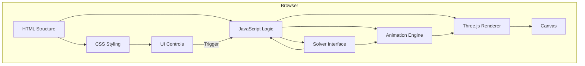

# 3. 系統模式 (System Patterns)

## 系統架構 (初步設想)

## 關鍵技術決策

*   **渲染與狀態管理**: 使用 Three.js 函式庫進行 WebGL 渲染，完全依賴 3D 模型的位置和旋轉來表示方塊狀態。每個方塊在初始化時就設定正確的顏色。

*   **動畫**: 
    - 使用 `requestAnimationFrame` (由 Three.js 內部管理) 
    - 使用 Tween.js 實現平滑的旋轉動畫
    - 直接操作 3D 物件而不是透過狀態管理

*   **解題邏輯 (簡易版)**: 記錄打亂序列，解題時將序列反轉並反向執行。

## 設計模式考量

*   **模組化**: 將渲染、狀態管理、動畫、解題邏輯分離成獨立的模組或類別。
*   **狀態模式**: 可能用於管理應用程式的不同狀態（例如：空閒、隨機化中、解題動畫中）。
*   **命令模式**: 或許可以用於封裝魔術方塊的旋轉操作（U, F, R' 等）。

## 組件關係

*   **UI**: 負責接收使用者輸入（按鈕點擊）並顯示資訊（步驟序列）。

*   **Three.js Renderer**: 
    - 負責 3D 渲染和狀態管理
    - 直接管理方塊的位置、旋轉和顏色
    - 提供重置功能以回到初始狀態

*   **Animation Engine**: 整合在 `CubeRenderer.js` 中，負責旋轉動畫。

*   **Solver Interface**: 純邏輯模組，負責反轉打亂序列。

## 關鍵實作路徑

1.  **3D 渲染與狀態管理**:
    - 設置 Three.js 場景
    - 創建 3x3x3 方塊網格並設定正確顏色
    - 實現直接的旋轉操作

2.  **動畫系統**:
    - 使用 Tween.js 實現平滑旋轉
    - 實作重置功能

3.  **操作邏輯**:
    - 實作打亂序列生成
    - 實作解法序列生成（打亂序列的反轉）

4.  **UI 互動**:
    - 實作打亂按鈕觸發流程：重置 -> 打亂
    - 實作解題按鈕觸發流程
